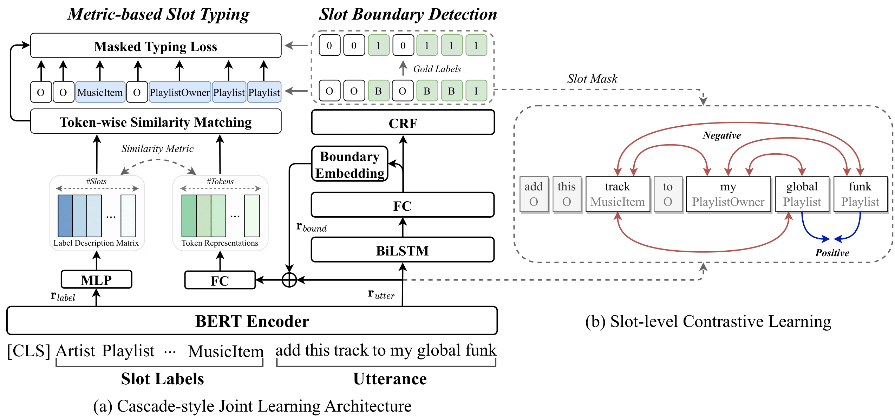

# AdaE2ML-XSF
Code repository for our EMNLP2023 paper "[Adaptive End-to-End Metric Learning for Zero-Shot Cross-Domain Slot Filling](https://arxiv.org/abs/2310.15294)"
## Overall Framework


# How to run
We choose one target domain each time and the rest of domains are combined as source within [SNIPS](https://arxiv.org/pdf/1805.10190.pdf) dataset under cross-domain setting. For zero-resource setting, we select CoNLL03 English NER as source dataset and SciTech NER as target dataset. Considering the cross-dataset setting, we select SNIPS as source(target) domain while ATIS as target(source) domain.

## Preparations
### 1. Data Preparation
* We put the raw SNIPS dataset under data/raw_dataset/original_snips_data. The following commands might be useful for preparation:
```shell
cd YOUR_PATH_TO/zero-shot-slu
mkdir data/snips
python data/raw_dataset/preprocess_snips.py
```

* We also put the raw ATIS dataset under data/raw_dataset/atis. The following preprocessing commands are used for cross-dataset setting:
```shell
cd YOUR_PATH_TO/zero-shot-slu
mkdir data/merge_dataset
mkdir data/merge_dataset/snips
mkdir data/merge_dataset/atis
python data/dataPreprocessingM.py
``` 

* For [SciTech NER](https://github.com/jiachenwestlake/Cross-Domain_NER/tree/master/unsupervised_domain_adaptation/data/news_tech) dataset, please refer to this link and put the dataset under data/ner/tech folder.

### 2. Pretrained Model Preparation
```shell
mkdir bert_model
git lfs install
git clone https://huggingface.co/bert-base-uncased
```

### 3. Environments
We implement our method with Pytorch 1.8. Other required packages could be found in requirements.txt

## Key Configurations
- ```--tgt_dm:``` SNIPS target domain
- ```--n_samples:``` Number of samples used in the target domain, for K-shot, set n_samples to K
- ```--cl:``` using slot-level CL
- ```--cl_type:``` slot-level CL metric function
- ```--cl_temperature:``` slot-level CL temperature \tau
- ```--alpha:``` scalar coefficient of typing loss(L_typ) with default to 1.0
- ```--beta:``` scalr coefficient of slot-CL loss(L_ctr) with default to 1.0
- ```--model_ckpt:``` Saved model path
- ```--vocab_ckpt:``` Saved vocab path

## Zero-shot Cross-domain Slot Filling
Train our model for zero-shot adaptation to GetWeather domain:
```console
❱❱❱ python slu_e2e_bert_f2train.py --cuda 0 -lr 1e-3 --n_sample 0 --tgt_dm GetWeather --epoch 30 --dropout 0.1 --cl --cl_type cosine --cl_temperature 0.5 --model_ckpt loss_log/test.ckpt --vocab_ckpt loss_log/test_vocab.ckpt
```

Train our model without slot-CL for zero-shot adaptation to GetWeather domain:
```console
❱❱❱ python slu_e2e_bert_f2train.py --cuda 0 -lr 1e-3 --n_sample 0 --tgt_dm GetWeather --epoch 30 --dropout 0.1 --model_ckpt ckpt/end2end_cl/bert_domain_atp0.ckpt --vocab_ckpt ckpt/vocab/bert_domain_atp0_vocab.ckpt
```

## Few-shot Cross-domain Slot Filling
Train our model for 50-shot adaptation to GetWeather domain:
```console
❱❱❱ python slu_e2e_bert_f2train.py --cuda 0 -lr 1e-3 --n_sample 50 --tgt_dm GetWeather --epoch 30 --dropout 0.1 --cl --cl_type cosine --cl_temperature 0.5 --model_ckpt loss_log/test.ckpt --vocab_ckpt loss_log/test_vocab.ckpt
```

## Cross-dataset setting
To train and evaluate our model under the cross-dataset scenario (i.e. SNIPS <-> ATIS), you can use the following commands:
```shell
❱❱❱ python f2xDataset.py --cuda 0 -lr 1e-3 --src snips --tgt atis --alpha 1.5 --beta 1.0 --epoch 30 --dropout 0.1 --cl --cl_type cosine --cl_temperature 0.5 --model_ckpt snips-atis.ckpt --vocab_ckpt snips-atis_vocab.ckpt
❱❱❱ python f2xDataset.py --cuda 0 -lr 1e-4 --src atis --tgt snips --batch_size 8 --alpha 2.0 --beta 2.0 --epoch 30 --dropout 0.1 --cl --cl_type euclidean --cl_temperature 0.5 --model_ckpt snips-atis.ckpt --vocab_ckpt snips-atis_vocab.ckpt
```

## Cross-domain NER
Train our model for zero-resource adaptation to sci-t
ech domain
```console
❱❱❱ python ner_e2e_train.py --cuda 0 -lr 1e-3 --n_sample 0 --tgt_dm tech --epoch 30 --dropout 0.5 --cl --cl_type cosine --cl_temperature 0.1 --model_ckpt test_tech.ckpt --vocab_ckpt test_vocab.ckpt
```

Train our model without slot-level CL for zero-resource adaptation to sci-tech domain
```console
❱❱❱ python ner_e2e_train.py --cuda 0 -lr 1e-3 --n_sample 0 --tgt_dm tech --epoch 30 --dropout 0.5 --model_ckpt test_tech.ckpt --vocab_ckpt test_vocab.ckpt
```

# Citation
If you use any source codes or ideas included in this repository for your work, please cite the following paper.
```
@inproceedings{shi-etal-2023-adaptive,
    title = "Adaptive End-to-End Metric Learning for Zero-Shot Cross-Domain Slot Filling",
    author = "Shi, Yuanjun  and
      Wu, Linzhi  and
      Shao, Minglai",
    editor = "Bouamor, Houda  and
      Pino, Juan  and
      Bali, Kalika",
    booktitle = "Proceedings of the 2023 Conference on Empirical Methods in Natural Language Processing",
    month = dec,
    year = "2023",
    address = "Singapore",
    publisher = "Association for Computational Linguistics",
    url = "https://aclanthology.org/2023.emnlp-main.387",
    doi = "10.18653/v1/2023.emnlp-main.387",
    pages = "6291--6301"
}
```
